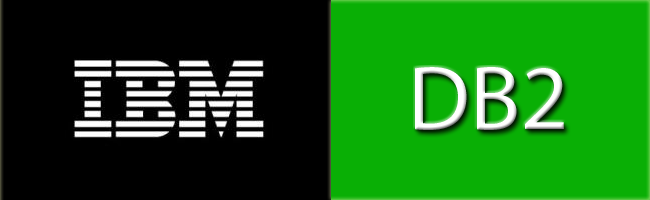
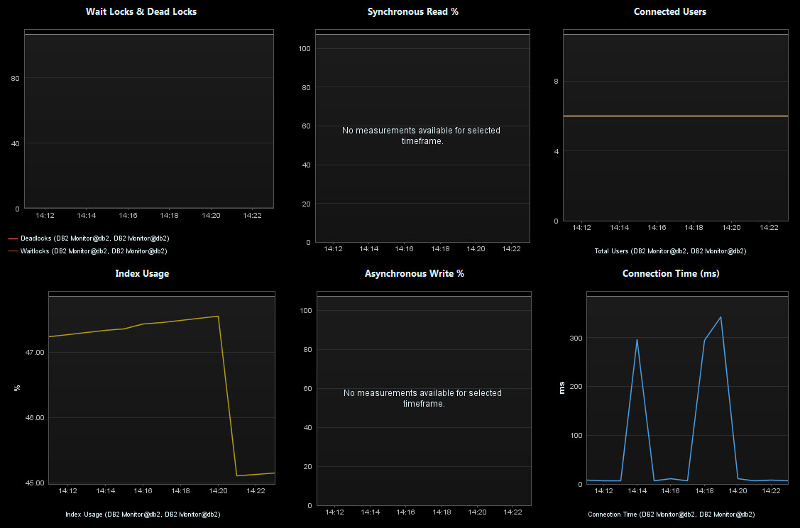

# DB2 Monitor Plugin

## Overview

  

The DB2 plugin enables monitoring behavior metrics provided in a DB2 database.The plugin uses JDBC to connect to the DB2 Database and queries key performance metrics. Having these measures in
dynaTrace enables quick correlation of database related performance issues such as high I/O or too many database connections to application transaction performance problems such as long running
transactions or slow database queries.

Since this plugin is currently in BETA, please follow the best practice of having a separate collector for your monitoring plugins.

## Plugin Details

| Plug-In Files |dynaTrace 4.x+:
| :------------ | :------------  
| |[DB2 Monitor Plugin 0.8.0](com.dynatrace.diagnostics.plugins.DB2Plugin_0.8.0.jar)  
||[DB2 Monitor Dashboard ](DB2_Overview.dashboard.xml)
| Author |Eric Burns (Eric.burns@compuware.com)
| dynaTrace Versions |4.1+
| License |[dynaTrace BSD](dynaTraceBSD.txt)
| Support | [Not Supported](https://community.compuwareapm.com/community/display/DL/Support+Levels)
| Known Problems |
| Release History | 2012-07-12 0.8.0 Initial BETA Release

## Provided Measures

The following image shows the metrics that the monitor provides:

## Configuration DB2 Monitor

The monitor requires the following configuration settings:

  * hostName: Host name of the DB2 Database Instance 

  * dbName: Database Instance Name (SID) or Service name 

  * dbUsername: Username that is used to access the database. User may needs to have query rights to a specific tables 

  * dbPassword: Password that is used to access the database 

  * dbPort: DB2 Database Port for JDBC Connections (default: 50001) 

## Installation

Import the Plugin into the dynaTrace Server via the dynaTrace Server Settings menu -> Plugins -> Install Plugin. For details how to do this please refer to the [dynaTrace
documentation](https://apmcommunity.compuware.com/community/display/DOCDT42/Plugins).

To use the provided dashboard please leave the default name of the Monitor as "RepositoryDB", then open the Dashboard and set the Data Source accordingly.

## Access Requirements

This plugin accesses the following tables, so it must be able to connect and have SELECT privileges:

  * sysibmadm.applications 

  * sysibmadm.snapdb 

## Usage Notes

This release is very much in Beta. Please send feedback and help to improve it.

Metric Groups will be changed/altered in a later release. Would like input from DB2 DBAs.

